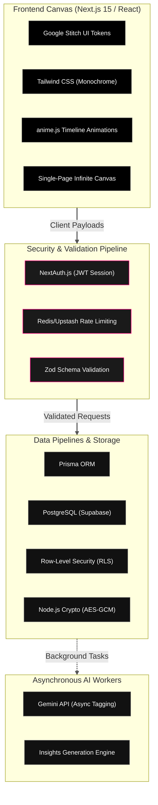

---
tags:
  - Project
  - finance
  - projects/fin-app/project-doc
---

---

# System Requirements & Architecture Document
## Project: Minimalist Multi-Asset Personal Finance Engine (MVP)

## 1. Executive Summary & Vision
This application is a hyper-minimalist, high-performance personal finance engine engineered for multi-asset consolidation. Bypassing generic, intrusive conversational "AI chatbots," the platform targets high-fidelity visual trajectories, kinetic hardware-style animations, and an absolute 4-pillar security model. The visual layout and component architecture are heavily inspired by the **Nothing OS** design aesthetic.

### Core Architecture Pillars
* **The 4-Pillar Security Matrix:** Absolute enforcement of Authentication, Rate Limiting, Row-Level Security (RLS), and Server-Side Validation.
* **Cohesive Visual Identity:** Strict maintenance of a monochrome, dot-matrix, low-ink UI scaffolded through Google Stitch and dynamically animated via `anime.js`.
* **Deterministic Execution:** Prioritizing native code logic and secure data pipelines, leveraging Gemini AI exclusively for asynchronous background processing and schema discovery.

---

## 2. Technical Stack Matrix

The application utilizes a specialized decoupled architecture: a fluid React frontend governed by timeline-based structural motion, backed by a highly secure serverless API and a robust PostgreSQL database.

### Core Technologies

- **Frontend Framework:** Next.js 15 (App Router) utilizing server-side rendering advantages for layout bounds and localized static processing.

- **Design Systems Canvas:** **Google Stitch** handles UI ideation, visual system layout extraction, component prototyping, and exporting production-ready React/Tailwind scaffolding.

- **UI Design Language:** Tailwind CSS matching the Nothing OS aesthetic—strict black/white scales, dot-matrix grid canvas elements, and custom `#FF007F` red visual markers.

- **Motion & Animation:** `anime.js` acting as the core animation engine for kinetic micro-interactions, staggered data reveals, hardware-style easing, and rigid SVG path drawing.

- **Database & Connectivity Layer:** PostgreSQL via Supabase, strictly configured with Prisma ORM to ensure type-safe relational schemas.

- **Core Cognitive Engine:** Gemini (Pro/Flash API) running exclusively out-of-band for text normalizations, metadata parsing, and historical insights generation.

## 3. Core Feature Specifications (MVP Scope)

### A. Consolidated Multi-Archetype Ledger

The platform unifies disparate financial vehicles into a cohesive time-series graph:

- **Liquid & Credit Accounts:** Automatic extraction via supported neobank APIs; legacy bank ingestion processed through local file parsers.

- **Investment Vehicles (Stocks & Managed Funds):** Cost-basis tracked via historical transaction records (buys/sells).

- **Live Valuation Engine:** A secure background worker periodically pulls asset price updates via lightweight ticker APIs, overlaying live asset prices onto the user's transaction history to maintain real-time net worth valuation.

### B. Two-Tier Data Ingestion Pipeline

To limit token waste and preserve deterministic reliability, CSV ingestion follows a strict execution path:

1. **Static Profiler (Primary):** The user defines column configurations once (e.g., Column A = Date, Column B = Description). This schema mapping is compiled as a localized Static Profile (`AMEX_Daily_Export`). Future uploads run purely via native JS code parsing, utilizing zero AI overhead.

2. **AI-Parsing Layer (Fallback):** In the event of an unmapped file format or sudden structural update by an institution, Gemini scans the file structure, normalizes the data array, handles column matching, and prompts the user to save the result as a new permanent Static Profile.

### C. Background Intelligence Platform

AI is strictly integrated as an asynchronous utility layer:

- **Asynchronous Transaction Categorization:** Gemini operates purely in background threads, translating ambiguous, messy vendor descriptions into normalized taxonomy tags.

- **The Insights Engine:** A dedicated text component positioned at the baseline fold of the viewport. The engine passively feeds current spending trajectories and income baselines (e.g., tracking the $6,289.56 fortnightly gross) to Gemini to output precise, actionable bulletins (e.g., assessing the exact timeline for a Hills Showground property deposit target).

## 4. UI/UX & Kinetic Motion Design

- **The Infinite Viewport Canvas:** The entire system maps onto a single, continuous vertical scroll interface. Traditional layout switching is entirely eliminated.

- **Kinetic Anchoring (`anime.js`):** Menu triggers invoke hardware-accelerated smooth scrolling that locks onto targeted interface components instantly. Data visualizations and charts draw in using staggered SVG timeline animations.

- **Hero Visualization:** The top fold of the interface establishes the baseline metrics, presenting a high-contrast numeric display of **Total Net Worth** paired with a rigid, thin-line time-series trend area chart and operational velocity readouts.

## 5. Absolute Technical Laws for AI & Engineering Agents

Agents writing or refactoring code within this repository MUST obey these absolute technical laws:

> [!lock] Law 1: The 4-Pillar Security Matrix
> 
> - **Authentication:** All protected application routes and API endpoints must be guarded by NextAuth.js configured with a secure JWT strategy.
>     
> - **Row-Level Security (RLS):** The Supabase PostgreSQL database MUST have strict RLS policies enabled on every single table. The user's JWT session token must be passed to the database context so the engine mathematically rejects any query attempting to read or mutate rows belonging to a different `userId`.
>     
> - **Server-Side Validation:** Absolutely no data payload from the client (including manual entries or CSV arrays) may touch Prisma or the database without first successfully passing through a strictly typed `Zod` validation schema.
>     
> - **Rate Limiting:** Next.js Middleware must implement a sliding-window rate limiter (e.g., via Upstash Redis) to protect core API routes and authentication endpoints from brute-force or DDOS execution.
>     

> [!warning] Law 2: Database-Level Aggregations Only (Prisma Math)
> 
> Whenever calculating total account balances, category distributions, or running totals, you must use Prisma native math aggregations (`_sum`, `_avg`, `_count`). Do not fetch thousands of transaction rows into server memory to execute intensive JavaScript `.reduce()` loops.

> [!warning] Law 3: Absolute Ban on Nested $O(N^2)$ Loops
> 
> When matching duplicate transactions, finding internal transfers, or staging bulk file imports, nested loops are strictly prohibited. You must structure normalization logic using JavaScript `Map` structures (e.g., grouping elements by ID or Amount) to execute data deduplication in linear $O(N)$ time.

> [!lock] Law 4: Secure Credential Storage
> 
> Third-party API tokens (like Bank Developer Keys or Ticker API credentials) must be symmetrically encrypted via Node.js native `crypto` using `AES-256-GCM` before being written to the database.

> [!info] Law 5: Zero-AI-Slop Deterministic Pipelines
> 
> The Gemini API must never run synchronously on the main thread during standard user navigation or core dashboard reads. Ingestion jobs must evaluate static template rules first. Gemini is restricted to background tag parsing and design-time schema discovery.

> [!info] Law 6: Visual Coherence via Google Stitch Configuration
> 
> The frontend component architecture must strictly match layout constraints defined in `.stitch/DESIGN.md`. Any automated code generation or UI additions must reference the Google Stitch design token dictionary to preserve the Nothing OS typography, monochrome scaling, frosted glass materials, and restricted accent rules.

