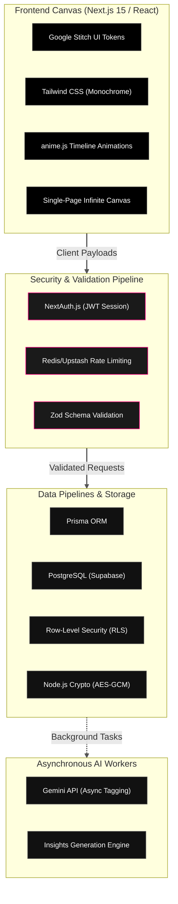

---
tags:
  - Project
  - finance
  - projects/fin-app/project-doc
---

---

# System Requirements & Architecture Document
## Project: Minimalist Multi-Asset Personal Finance Engine (MVP)

## 1. Executive Summary & Vision
This application is a hyper-minimalist, high-performance personal finance engine engineered for multi-asset consolidation. Bypassing generic, intrusive conversational "AI chatbots," the platform targets high-fidelity visual trajectories, kinetic hardware-style animations, and an absolute 4-pillar security model. The visual layout and component architecture are heavily inspired by the **Nothing OS** design aesthetic.

### Core Architecture Pillars
* **The 4-Pillar Security Matrix:** Absolute enforcement of Authentication, Rate Limiting, Row-Level Security (RLS), and Server-Side Validation.
* **Cohesive Visual Identity:** Strict maintenance of a monochrome, dot-matrix, low-ink UI scaffolded through Google Stitch and dynamically animated via `anime.js`.
* **Deterministic Execution:** Prioritizing native code logic and secure data pipelines, leveraging Gemini AI exclusively for asynchronous background processing and schema discovery.

---

## 2. Technical Stack Matrix

The application utilizes a specialized decoupled architecture: a fluid React frontend governed by timeline-based structural motion, backed by a highly secure serverless API and a robust PostgreSQL database.

### Core Technologies

- **Frontend Framework:** Next.js 15 (App Router) utilizing server-side rendering advantages for layout bounds and localized static processing.

- **Design Systems Canvas:** **Google Stitch** handles UI ideation, visual system layout extraction, component prototyping, and exporting production-ready React/Tailwind scaffolding.

- **UI Design Language:** Tailwind CSS matching the Nothing OS aesthetic—strict black/white scales, dot-matrix grid canvas elements, and custom `#FF007F` red visual markers.

- **Motion & Animation:** `anime.js` acting as the core animation engine for kinetic micro-interactions, staggered data reveals, hardware-style easing, and rigid SVG path drawing.

- **Database & Connectivity Layer:** PostgreSQL via Supabase, strictly configured with Prisma ORM to ensure type-safe relational schemas.

- **Core Cognitive Engine:** Gemini (Pro/Flash API) running exclusively out-of-band for text normalizations, metadata parsing, and historical insights generation.

## 3. Core Feature Specifications (MVP Scope)

### A. Consolidated Multi-Archetype Ledger

The platform unifies disparate financial vehicles into a cohesive time-series graph:

- **Liquid & Credit Accounts:** Automatic extraction via supported neobank APIs; legacy bank ingestion processed through local file parsers.

- **Investment Vehicles (Stocks & Managed Funds):** Cost-basis tracked via historical transaction records (buys/sells).

- **Live Valuation Engine:** A secure background worker periodically pulls asset price updates via lightweight ticker APIs, overlaying live asset prices onto the user's transaction history to maintain real-time net worth valuation.

### B. Two-Tier Data Ingestion Pipeline

To limit token waste and preserve deterministic reliability, CSV ingestion follows a strict execution path:

1. **Static Profiler (Primary):** The user defines column configurations once (e.g., Column A = Date, Column B = Description). This schema mapping is compiled as a localized Static Profile (`AMEX_Daily_Export`). Future uploads run purely via native JS code parsing, utilizing zero AI overhead.

2. **AI-Parsing Layer (Fallback):** In the event of an unmapped file format or sudden structural update by an institution, Gemini scans the file structure, normalizes the data array, handles column matching, and prompts the user to save the result as a new permanent Static Profile.

### C. Background Intelligence Platform

AI is strictly integrated as an asynchronous utility layer:

- **Asynchronous Transaction Categorization:** Gemini operates purely in background threads, translating ambiguous, messy vendor descriptions into normalized taxonomy tags.

- **The Insights Engine:** A dedicated text component positioned at the baseline fold of the viewport. The engine passively feeds current spending trajectories and income baselines (e.g., tracking the $6,289.56 fortnightly gross) to Gemini to output precise, actionable bulletins (e.g., assessing the exact timeline for a Hills Showground property deposit target).

## 4. UI/UX & Kinetic Motion Design

- **The Infinite Viewport Canvas:** The entire system maps onto a single, continuous vertical scroll interface. Traditional layout switching is entirely eliminated.

- **Kinetic Anchoring (`anime.js`):** Menu triggers invoke hardware-accelerated smooth scrolling that locks onto targeted interface components instantly. Data visualizations and charts draw in using staggered SVG timeline animations.

- **Hero Visualization:** The top fold of the interface establishes the baseline metrics, presenting a high-contrast numeric display of **Total Net Worth** paired with a rigid, thin-line time-series trend area chart and operational velocity readouts.

## 5. Absolute Technical Laws for AI & Engineering Agents

Agents writing or refactoring code within this repository MUST obey these absolute technical laws:

> [!lock] Law 1: The 4-Pillar Security Matrix
> 
> - **Authentication:** All protected application routes and API endpoints must be guarded by NextAuth.js configured with a secure JWT strategy.
>     
> - **Row-Level Security (RLS):** The Supabase PostgreSQL database MUST have strict RLS policies enabled on every single table. The user's JWT session token must be passed to the database context so the engine mathematically rejects any query attempting to read or mutate rows belonging to a different `userId`.
>     
> - **Server-Side Validation:** Absolutely no data payload from the client (including manual entries or CSV arrays) may touch Prisma or the database without first successfully passing through a strictly typed `Zod` validation schema.
>     
> - **Rate Limiting:** Next.js Middleware must implement a sliding-window rate limiter (e.g., via Upstash Redis) to protect core API routes and authentication endpoints from brute-force or DDOS execution.
>     

> [!warning] Law 2: Database-Level Aggregations Only (Prisma Math)
> 
> Whenever calculating total account balances, category distributions, or running totals, you must use Prisma native math aggregations (`_sum`, `_avg`, `_count`). Do not fetch thousands of transaction rows into server memory to execute intensive JavaScript `.reduce()` loops.

> [!warning] Law 3: Absolute Ban on Nested $O(N^2)$ Loops
> 
> When matching duplicate transactions, finding internal transfers, or staging bulk file imports, nested loops are strictly prohibited. You must structure normalization logic using JavaScript `Map` structures (e.g., grouping elements by ID or Amount) to execute data deduplication in linear $O(N)$ time.

> [!lock] Law 4: Secure Credential Storage
> 
> Third-party API tokens (like Bank Developer Keys or Ticker API credentials) must be symmetrically encrypted via Node.js native `crypto` using `AES-256-GCM` before being written to the database.

> [!info] Law 5: Zero-AI-Slop Deterministic Pipelines
> 
> The Gemini API must never run synchronously on the main thread during standard user navigation or core dashboard reads. Ingestion jobs must evaluate static template rules first. Gemini is restricted to background tag parsing and design-time schema discovery.

> [!info] Law 6: Visual Coherence via Google Stitch Configuration
> 
> The frontend component architecture must strictly match layout constraints defined in `.stitch/DESIGN.md`. Any automated code generation or UI additions must reference the Google Stitch design token dictionary to preserve the Nothing OS typography, monochrome scaling, frosted glass materials, and restricted accent rules.

---

## 6. Detailed Page & Component Specifications

This section defines the structural architecture, widgets, filters, and fields required for each user-facing viewport.

### A. Main Dashboard Page
* **Welcome Message Header:** Displays a dynamic welcome greeting paired with the current system date.
* **Hero Performance Stats (3 High-Contrast Monospace Cards):**
  * *Total Net Worth:* Aggregated sum of all accounts (liquid, credit, investments, managed funds) minus liabilities.
  * *30-Day Income Flow:* Total net inflows recorded over the trailing 30 days.
  * *30-Day Expense Flow:* Total net outflows recorded over the trailing 30 days.
* **Asset Allocation Widget:**
  * *Donut Chart:* Monochromatic visual tracking proportion of asset classes/categories relative to total net worth.
  * *Category Progress Bars:* Vertical or horizontal stack tracking proportion of total, annotated with the absolute monetary value and the percentage of total net worth.
* **Net Worth Over Time Chart:**
  * *Time-Series Line Graph:* Tracks total net worth trajectory.
  * *Timeline Selector Switch:* 30-Day, 3-Month, 6-Month, and 1-Year bounds.
* **Connected Accounts Directory:**
  * *Tabular Ledger:* Lists all connected financial accounts showing name, type (e.g., liquid, credit, investment), connection/ingestion type (e.g., API Sync, CSV import), and current valuation.
* **Recent Transactions Feed:**
  * *Tabular Feed:* Chronological transaction stream, paginated or capped to load 10 items at a time.

### B. Accounts Detail Section
*Focuses on granular details for a selected account, equipped with dynamic account context switching.*
* **Account Selector Component:** Dropdown/list interface to switch active account context.
* **Account Header:** Displays active account name, type, and primary ingestion method.
* **Hero Cards (4 Monospace Performance Cards):**
  * *Account Balance:* Current valuation of the selected account.
  * *Income (Period):* Total inflows within the selected filter period.
  * *Expenses (Period):* Total outflows within the selected filter period.
  * *Net Cash Flow (Period):* Period Income minus Period Expenses.
* **Chronological Net Balance Trend:** Line graph tracking account balance trajectory over the selected period.
* **Expense Category Donut Chart:** Visual breakdown of outbound flow per category, presenting absolute category amounts and percentage of the selected account's total outbound flow.
* **Multi-Dimensional Filter Bar:**
  * *Quick Timeline Selectors:* All Time, This Week, This Month, Last Month, Last 3 Months, YTD, AU Financial Year to Date.
  * *Keyword Search:* Filters transaction descriptions/merchants.
  * *Transaction Type:* Filter by debit/credit (inflow/outflow).
  * *Category Filter:* Multi-select category taxonomy.
  * *Date Range Picker:* Custom start/end bounds.
* **Account Transactions Ledger:**
  * *Tabular Feed (10 items per page):* Displays date, description, category, and amount.
  * *Inline Actions:* Modify (re-categorize or adjust description) or Remove (soft-delete/exclude transaction).

### C. Income & Strategy Section
*Equipped with a tab switcher to transition between the Income Analyser and Strategic Projections views.*

#### Tab 1: Income Analyser
* **Header:** Title and description.
* **Time Range Selector:** Quick timeline switches + custom date range inputs.
* **Account Multi-Select Filter:** Checkbox dropdown to select/deselect specific accounts in calculations.
* **Hero Analytics Cards (4 Cards):**
  * *Inflow (Period):* Sum of all inflows.
  * *Prorated Monthly Average:* Calculated monthly run rate of inflows over the selected period.
  * *Peak Deposit Item:* Single largest deposit transaction details (date, merchant/source, value).
  * *Inflow/Outflow Coverage Ratio:* Ratio of total inflows to total outflows for the period.
* **Net Cash Flow Pacing:** Line graph tracking income pacing vs. average baseline.
* **Income Distribution Chart:** Monochromatic breakdown of income sources and parent categories.

#### Tab 2: Strategic Projections
* **AI Advisory Hub / Briefing:** Minimalist bulletin box displaying 3 tactical financial insights in heading and paragraph format (generated asynchronously).
* **Strategic Financial Goals Section:**
  * *Goal Tracking Card:* Shows goal name header, target milestone value, progress bar, and forecasted horizon date (along with a "Days Until Reached" counter calculated via AI).
* **Wealth Trajectory Plot:**
  * *Chart:* Combines actual historical net worth data with a projected future trajectory line and an explicit horizontal target goal marker.

### D. Expenses Section
*Equipped with a tab switcher to transition between Expense Analytics and the Recurring Hub views.*

#### Tab 1: Analytics
* **Header:** Section title, date bounds.
* **Account Filter:** Select/deselect specific accounts in calculations.
* **Query Parameter Filter Bar:**
  * *Search:* Keyword input for descriptions/merchants.
  * *Category & Sub-Category:* Hierarchical taxonomy selectors.
  * *Date Range:* Custom start/end dates.
  * *Amount Range:* Minimum and maximum value filters.
  * *Quick Timeline Selectors:* This Week, This Month, Last Month, Last 3 Months, etc.
* **Hero Cards (4 Cards):**
  * *Outflow Period Total:* Sum of all expenses.
  * *Daily Aggregate Average:* Average daily expense value over the period.
  * *Heavyweight Category:* The category with the highest total expense.
  * *Top Merchant/Vendor:* The vendor associated with the highest total expenditure.
* **Net Expenses Chart:** Line graph of chronological cumulative expenses for the selected period.
* **Daily Spikes Bar Chart:** Identifies days of unusual high-volume spending.
* **Expense Hierarchy Flow Chart:** Monochromatic flow layout representing hierarchy from left to right: `Total Outflow` > `Category` > `Sub-Category`.
* **Category Volatility & Pacing Component:**
  * *Progress Indicators:* Progress bars comparing current period category spend against previous period baseline.
  * *Metadata indicators:* Tracks absolute variance and percentage saved/exceeded.
* **Ranked Top 10 Merchants List:** Clean high-density list of top 10 merchants by cost.
* **Ledger Expenses:** Capped tabular display of expense transactions (10 loaded at a time).

#### Tab 2: Recurring Hub
* **Header:** Section title, date bounds.
* **Hero Cards (4 Cards):**
  * *Monthly Commitment:* Estimated monthly sum of all recurring obligations.
  * *Annualized Cash Burn:* Projected annual recurring cost run rate (commitments multiplied out to 12-month bounds).
  * *Fixed Outflow Pressure:* Ratio of recurring expenses against total 30-day expenditures.
  * *Active Commitments:* Total count of active subscription/recurring structures.
* **Recurring Commitments Directory:**
  * *Sectional Table:* Organized by category, with sub-totals and totals.
  * *Row Metadata:* Cadence (frequency), fixed vs. variable indicator, last charged date, expected next date, and source account link.
* **30-Day Billing Calendar:**
  * *Matrix Calendar Grid:* A 7-column grid highlighting calendar days where fixed expenses occur, with monochromatic heat intensity weighted by transaction amount.
* **Smart Insights Bulletins:** Monochromatic insights box showing AI-analyzed patterns in recurring subscriptions.

### E. Ingestion Portal
* **Header:** Title, instructions, system date.
* **"Import New Export" Widget:**
  * *Account Context:* Select target account database to update.
  * *Parser Ingestion Engine Selector:* Choose corresponding static profile/parser template.
* **Drag-and-Drop Area:** Interactivity zone for statement CSV upload.
* **Action Button:** "Analyze staging buffer" to execute schema parsing and direct transaction duplicates resolution.
* **API Integration Card:** "Automate with bank API" CTA button to link/refresh API tokens.
* **Same-Day Osko Linker:**
  * *Reconciliation Panel:* Identifies and pairs matching counter-transfers (e.g., transfers between internal accounts on the same day) in the uploaded statements, presenting them to the user to accept/approve pairing with a single action.

### F. Hidden Admin Portal
*Accessible only to users carrying the authenticated role of ADMIN.*
* **Platform Metrics:** Total platform users, total active API connections, master/tenant database files sizes.
* **User Directory:** Interactive table of all registered platform users, email addresses, and their assigned roles (e.g., `ADMIN`, `USER`).

### G. Settings & Profile Section
* **Settings Panel:** Profile info, configuration settings, password rotation, theme preferences, and master account options.

