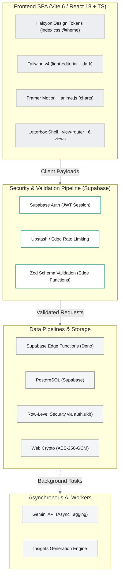

---
aliases:
  - SRD
  - System Requirements
  - Halcyon SRD
tags:
  - halcyon
  - projects/fin-app
  - finance
type: requirements
status: current
project: Halcyon
up: "[[CONTEXT]]"
related:
  - "[[MVP_SCOPE]]"
  - "[[Halcyon_DesignSystem]]"
  - "[[MIGRATION_PLAN]]"
---

# System Requirements & Architecture Document
## Project: Halcyon — Minimalist Multi-Asset Personal Finance Engine

> **Reconciled to the canonical build.** This document is the full product vision + security
> model for Halcyon. It has been aligned with the locked decisions in [CONTEXT.md](CONTEXT.md) §2:
> the stack is **Vite + React SPA + Supabase-direct** (not Next.js), the aesthetic is the
> **Halcyon light-editorial design language** (not Nothing OS), and the design source of truth is
> [Halcyon_DesignSystem.md](Halcyon_DesignSystem.md) + `app/src/index.css` (no Google Stitch).
> For *what ships first*, see [MVP_SCOPE.md](MVP_SCOPE.md); this SRD describes the whole product,
> including the deferred phases.

## 1. Executive Summary & Vision
Halcyon is a hyper-minimalist, high-performance personal finance engine engineered for multi-asset consolidation. Bypassing generic, intrusive conversational "AI chatbots," the platform targets high-fidelity visual trajectories, calm kinetic motion, and an absolute 4-pillar security model. The visual layout and component architecture follow the **Halcyon design system** — a light, editorial language (frosted glass, a single mint accent, a cinematic letterbox frame, heavy display type) shipping in light and dark themes.

### Core Architecture Pillars
* **The 4-Pillar Security Matrix:** Absolute enforcement of Authentication, Rate Limiting, Row-Level Security (RLS), and Server-Side Validation — re-homed to Supabase (see §5, Law 1).
* **Cohesive Visual Identity:** Strict maintenance of the Halcyon design system, authored once against design tokens and expressed through light and dark themes.
* **Deterministic Execution:** Prioritizing native code logic and secure data pipelines, leveraging Gemini AI exclusively for asynchronous background processing and schema discovery.

---

## 2. Technical Stack Matrix

The application uses a decoupled architecture: a fluid React **single-page app** (Vite) governed by token-driven structural motion, backed by Supabase (Auth + Postgres + RLS + Edge Functions) and a robust PostgreSQL database.

### Core Technologies

- **Frontend Framework:** **Vite 6 + React 18 (TypeScript, no StrictMode)** — a static single-page app built to `dist/` and deployable to any static host. Navigation is a lightweight **state-based view-router** (a `view` state + context), not server routing and not an infinite canvas.

- **Design System:** The **Halcyon Design System** is the single source of UI truth — the human-readable spec is [Halcyon_DesignSystem.md](Halcyon_DesignSystem.md); the machine source of truth for every token (light + dark) is `app/src/index.css` (`@theme` block + `:root` vars + `.dark` override). All component work references these tokens.

- **UI Design Language:** Tailwind v4 (CSS-first `@theme`) expressing the Halcyon light-editorial aesthetic — a single surface tone, frosted-glass tiles (backdrop-blur), a single mint accent (`#11b596`), the semantic trio (positive / warning / negative), a cinematic letterbox frame, and heavy display typography. Near-monochrome ink-on-surface; colour signals state, never decoration.

- **Motion & Animation:** A strict two-library split. **Framer Motion 11** owns layout, view routing, the shared-element hero morph, the tile blur-focus entrance, scramble, and count-ups. **anime.js 3** owns **chart internals only** (SVG draw-on, dashoffset, counters), wired through the `useChartReveal` firewall (scoped, motion-aware, self-cleaning). No element is animated by both.

- **Database & Connectivity Layer:** **PostgreSQL via Supabase**, strictly configured with Row-Level Security on every table. All mutations route through **Supabase Edge Functions (Deno)** gated by Zod; reads run via PostgREST under RLS. (This is the **Supabase-direct** backend — it removes the NextAuth↔RLS friction because Supabase Auth issues the JWT that RLS reads natively.)

- **Core Cognitive Engine:** Gemini (Pro/Flash API) running exclusively out-of-band for text normalizations, metadata parsing, and historical insights generation — never on the main thread (see §5, Law 5).

## 3. Core Feature Specifications (full product scope)

> Phasing note: only a thin vertical slice is the MVP — see [MVP_SCOPE.md](MVP_SCOPE.md). Features
> below marked as bank sync, live valuation, AI tagging, recurring, and admin are deferred to
> Phases 2–5 (see [CONTEXT.md](CONTEXT.md) §9).

### A. Consolidated Multi-Archetype Ledger

The platform unifies disparate financial vehicles into a cohesive time-series graph:

- **Liquid & Credit Accounts:** Automatic extraction via supported neobank APIs (AU CDR / Basiq, *Phase 3*); legacy bank ingestion processed through local file parsers (*MVP*).

- **Investment Vehicles (Stocks & Managed Funds):** Cost-basis tracked via historical transaction records (buys/sells) (*Phase 3*).

- **Live Valuation Engine:** A secure background worker periodically pulls asset price updates via lightweight ticker APIs, overlaying live asset prices onto the user's transaction history to maintain real-time net worth valuation (*Phase 3*).

### B. Two-Tier Data Ingestion Pipeline

To limit token waste and preserve deterministic reliability, CSV ingestion follows a strict execution path:

1. **Static Profiler (Primary, *MVP*):** The user defines column configurations once (e.g., Column A = Date, Column B = Description). This schema mapping is compiled as a localized Static Profile (`AMEX_Daily_Export`). Future uploads run purely via native JS code parsing, utilizing zero AI overhead.

2. **AI-Parsing Layer (Fallback, *Phase 3*):** In the event of an unmapped file format or sudden structural update by an institution, Gemini scans the file structure, normalizes the data array, handles column matching, and prompts the user to save the result as a new permanent Static Profile.

### C. Background Intelligence Platform

AI is strictly integrated as an asynchronous utility layer (*Phase 2+*):

- **Asynchronous Transaction Categorization:** Gemini operates purely in background threads, translating ambiguous, messy vendor descriptions into normalized taxonomy tags.

- **The Insights Engine:** A dedicated text component positioned at the baseline fold of the viewport. The engine passively feeds current spending trajectories and income baselines (e.g., tracking the $6,289.56 fortnightly gross) to Gemini to phrase precise, actionable bulletins (e.g., assessing the exact timeline for a Hills Showground property deposit target). The underlying numbers are computed deterministically; Gemini only phrases the bulletin.

## 4. UI/UX & Kinetic Motion Design

- **The Letterbox Shell & view-router:** The system is a locked, full-viewport shell — a cinematic top header and bottom status strip (both `--color-bar`, darker than the workspace) frame a transparent screen region. Navigation is a state-based **view-router** across six views (Landing · Dashboard · Accounts · Income · Expenses · Ingestion) with Settings reached from the header gear. View swaps run through `<AnimatePresence mode="sync">` with views positioned `absolute inset-0`.

- **Shared-element hero morph:** The signature interaction — the landing hero card and the dashboard net-worth tile share `layoutId="hero"`, so Framer Motion physically morphs one into the other on navigation.

- **Kinetic chart motion (`anime.js`):** Data visualizations draw in using staggered SVG timeline animations (stroke draw-on, dashoffset, fill sweeps, counters) through the `useChartReveal` firewall — scoped per chart, motion-aware, and self-cleaning.

- **Hero Visualization:** The top fold establishes the baseline metrics, presenting a high-contrast **tabular-figure** display of **Total Net Worth** paired with a thin-line time-series trend area chart and operational velocity readouts. (Typography is proportional sans with tabular numerals — no monospace; see [Halcyon_DesignSystem.md](Halcyon_DesignSystem.md) §4.)

## 5. Absolute Technical Laws for AI & Engineering Agents

Agents writing or refactoring code within this repository MUST obey these absolute technical laws:

> [!lock] Law 1: The 4-Pillar Security Matrix (Supabase)
>
> - **Authentication:** All protected application routes and API endpoints must be guarded by **Supabase Auth** with a secure JWT strategy.
>
> - **Row-Level Security (RLS):** The Supabase PostgreSQL database MUST have strict RLS policies enabled on every single table, keyed on `auth.uid()`. Because Supabase Auth issues the JWT the database reads natively, the engine mathematically rejects any query attempting to read or mutate rows belonging to a different `userId`.
>
> - **Server-Side Validation:** Absolutely no data payload from the client (including manual entries or CSV arrays) may touch the database without first passing through a strictly typed `Zod` validation schema. All mutations route through **Supabase Edge Functions (Deno)** where this validation lives.
>
> - **Rate Limiting:** A sliding-window rate limiter (e.g., via Upstash Redis at the edge) must protect the auth and ingestion Edge Functions from brute-force or DDOS execution.

> [!warning] Law 2: Database-Level Aggregations Only
>
> Whenever calculating total account balances, category distributions, or running totals, you must use **SQL aggregate functions** (`sum()`, `avg()`, `count()`) in Postgres — via SQL views, RPC, or PostgREST. Do not fetch thousands of transaction rows into memory to execute intensive JavaScript `.reduce()` loops.

> [!warning] Law 3: Absolute Ban on Nested $O(N^2)$ Loops
>
> When matching duplicate transactions, finding internal transfers, or staging bulk file imports, nested loops are strictly prohibited. You must structure normalization logic using JavaScript `Map` structures (e.g., grouping elements by ID or Amount) to execute data deduplication in linear $O(N)$ time.

> [!lock] Law 4: Secure Credential Storage
>
> Third-party API tokens (like Bank Developer Keys or Ticker API credentials) must be symmetrically encrypted with `AES-256-GCM` (via the Web Crypto API in the Edge Function runtime) before being written to the database. (Relevant only once third-party tokens exist — *Phase 3*.)

> [!info] Law 5: Zero-AI-Slop Deterministic Pipelines
>
> The Gemini API must never run synchronously on the main thread during standard user navigation or core dashboard reads. Ingestion jobs must evaluate static template rules first. Gemini is restricted to background tag parsing, insight phrasing, and design-time schema discovery.

> [!info] Law 6: Visual Coherence via the Halcyon Design System
>
> The frontend component architecture must strictly match the constraints defined in [Halcyon_DesignSystem.md](Halcyon_DesignSystem.md), and the machine source of truth `app/src/index.css` (the `@theme` tokens, `:root` vars, and `.dark` override). Any automated code generation or UI additions must reference the Halcyon design tokens to preserve the light-editorial typography, frosted-glass materials, single mint accent, and the restricted-accent rule. Author against tokens; never hardcode a colour where a token exists.

---

## 6. Detailed Page & Component Specifications

This section defines the structural architecture, widgets, filters, and fields required for each user-facing viewport. The six views below map 1:1 to the implemented Halcyon views; tabbed sub-views (Income: Analyser/Projections; Expenses: Analytics/Recurring) and the admin portal are deferred (see [MVP_SCOPE.md](MVP_SCOPE.md)).

### A. Main Dashboard Page
* **Welcome Message Header:** Displays a dynamic welcome greeting paired with the current system date.
* **Hero Performance Stats (3 High-Contrast Tabular Cards):**
  * *Total Net Worth:* Aggregated sum of all accounts (liquid, credit, investments, managed funds) minus liabilities.
  * *30-Day Income Flow:* Total net inflows recorded over the trailing 30 days.
  * *30-Day Expense Flow:* Total net outflows recorded over the trailing 30 days.
* **Asset Allocation Widget:**
  * *Donut Chart:* Restrained-palette visual tracking proportion of asset classes/categories relative to total net worth.
  * *Category Progress Bars:* Vertical or horizontal stack tracking proportion of total, annotated with the absolute monetary value and the percentage of total net worth.
* **Net Worth Over Time Chart:**
  * *Time-Series Line Graph:* Tracks total net worth trajectory.
  * *Timeline Selector Switch:* 30-Day, 3-Month, 6-Month, and 1-Year bounds.
* **Connected Accounts Directory:**
  * *Tabular Ledger:* Lists all connected financial accounts showing name, type (e.g., liquid, credit, investment), connection/ingestion type (e.g., API Sync, CSV import), and current valuation.
* **Recent Transactions Feed:**
  * *Tabular Feed:* Chronological transaction stream, paginated or capped to load 10 items at a time.

### B. Accounts Detail Section
*Focuses on granular details for a selected account, equipped with dynamic account context switching.*
* **Account Selector Component:** Dropdown/list interface to switch active account context.
* **Account Header:** Displays active account name, type, and primary ingestion method.
* **Hero Cards (4 Tabular Performance Cards):**
  * *Account Balance:* Current valuation of the selected account.
  * *Income (Period):* Total inflows within the selected filter period.
  * *Expenses (Period):* Total outflows within the selected filter period.
  * *Net Cash Flow (Period):* Period Income minus Period Expenses.
* **Chronological Net Balance Trend:** Line graph tracking account balance trajectory over the selected period.
* **Expense Category Donut Chart:** Visual breakdown of outbound flow per category, presenting absolute category amounts and percentage of the selected account's total outbound flow.
* **Multi-Dimensional Filter Bar:**
  * *Quick Timeline Selectors:* All Time, This Week, This Month, Last Month, Last 3 Months, YTD, AU Financial Year to Date.
  * *Keyword Search:* Filters transaction descriptions/merchants.
  * *Transaction Type:* Filter by debit/credit (inflow/outflow).
  * *Category Filter:* Multi-select category taxonomy.
  * *Date Range Picker:* Custom start/end bounds.
* **Account Transactions Ledger:**
  * *Tabular Feed (10 items per page):* Displays date, description, category, and amount.
  * *Inline Actions:* Modify (re-categorize or adjust description) or Remove (soft-delete/exclude transaction).

### C. Income & Strategy Section
*Equipped with a tab switcher to transition between the Income Analyser and Strategic Projections views (the tabs are a Phase 2 addition over the shipped Income view).*

#### Tab 1: Income Analyser
* **Header:** Title and description.
* **Time Range Selector:** Quick timeline switches + custom date range inputs.
* **Account Multi-Select Filter:** Checkbox dropdown to select/deselect specific accounts in calculations.
* **Hero Analytics Cards (4 Cards):**
  * *Inflow (Period):* Sum of all inflows.
  * *Prorated Monthly Average:* Calculated monthly run rate of inflows over the selected period.
  * *Peak Deposit Item:* Single largest deposit transaction details (date, merchant/source, value).
  * *Inflow/Outflow Coverage Ratio:* Ratio of total inflows to total outflows for the period.
* **Net Cash Flow Pacing:** Line graph tracking income pacing vs. average baseline.
* **Income Distribution Chart:** Restrained-palette breakdown of income sources and parent categories.

#### Tab 2: Strategic Projections
* **AI Advisory Hub / Briefing:** Minimalist bulletin box displaying 3 tactical financial insights in heading and paragraph format (phrased asynchronously by Gemini over deterministic numbers).
* **Strategic Financial Goals Section:**
  * *Goal Tracking Card:* Shows goal name header, target milestone value, progress bar, and forecasted horizon date (along with a "Days Until Reached" counter — calculated deterministically; AI phrasing only).
* **Wealth Trajectory Plot:**
  * *Chart:* Combines actual historical net worth data with a projected future trajectory line and an explicit horizontal target goal marker.

### D. Expenses Section
*Equipped with a tab switcher to transition between Expense Analytics and the Recurring Hub views (Recurring Hub is Phase 4).*

#### Tab 1: Analytics
* **Header:** Section title, date bounds.
* **Account Filter:** Select/deselect specific accounts in calculations.
* **Query Parameter Filter Bar:**
  * *Search:* Keyword input for descriptions/merchants.
  * *Category & Sub-Category:* Hierarchical taxonomy selectors.
  * *Date Range:* Custom start/end dates.
  * *Amount Range:* Minimum and maximum value filters.
  * *Quick Timeline Selectors:* This Week, This Month, Last Month, Last 3 Months, etc.
* **Hero Cards (4 Cards):**
  * *Outflow Period Total:* Sum of all expenses.
  * *Daily Aggregate Average:* Average daily expense value over the period.
  * *Heavyweight Category:* The category with the highest total expense.
  * *Top Merchant/Vendor:* The vendor associated with the highest total expenditure.
* **Net Expenses Chart:** Line graph of chronological cumulative expenses for the selected period.
* **Daily Spikes Bar Chart:** Identifies days of unusual high-volume spending.
* **Expense Hierarchy Flow Chart:** Restrained-palette flow layout representing hierarchy from left to right: `Total Outflow` > `Category` > `Sub-Category`.
* **Category Volatility & Pacing Component:**
  * *Progress Indicators:* Progress bars comparing current period category spend against previous period baseline.
  * *Metadata indicators:* Tracks absolute variance and percentage saved/exceeded.
* **Ranked Top 10 Merchants List:** Clean high-density list of top 10 merchants by cost.
* **Ledger Expenses:** Capped tabular display of expense transactions (10 loaded at a time).

#### Tab 2: Recurring Hub
* **Header:** Section title, date bounds.
* **Hero Cards (4 Cards):**
  * *Monthly Commitment:* Estimated monthly sum of all recurring obligations.
  * *Annualized Cash Burn:* Projected annual recurring cost run rate (commitments multiplied out to 12-month bounds).
  * *Fixed Outflow Pressure:* Ratio of recurring expenses against total 30-day expenditures.
  * *Active Commitments:* Total count of active subscription/recurring structures.
* **Recurring Commitments Directory:**
  * *Sectional Table:* Organized by category, with sub-totals and totals.
  * *Row Metadata:* Cadence (frequency), fixed vs. variable indicator, last charged date, expected next date, and source account link.
* **30-Day Billing Calendar:**
  * *Matrix Calendar Grid:* A 7-column grid highlighting calendar days where fixed expenses occur, with restrained-palette heat intensity weighted by transaction amount.
* **Smart Insights Bulletins:** Insights box showing AI-analyzed patterns in recurring subscriptions.

### E. Ingestion Portal
* **Header:** Title, instructions, system date.
* **"Import New Export" Widget:**
  * *Account Context:* Select target account database to update.
  * *Parser Ingestion Engine Selector:* Choose corresponding static profile/parser template.
* **Drag-and-Drop Area:** Interactivity zone for statement CSV upload.
* **Action Button:** "Analyze staging buffer" to execute schema parsing and direct transaction duplicates resolution.
* **API Integration Card:** "Automate with bank API" CTA button to link/refresh API tokens (*Phase 3*).
* **Same-Day Osko Linker (*Phase 4*):**
  * *Reconciliation Panel:* Identifies and pairs matching counter-transfers (e.g., transfers between internal accounts on the same day) in the uploaded statements, presenting them to the user to accept/approve pairing with a single action.

> *Implementation note:* the shipped Ingestion view is currently a **simulator** (no real mutation yet) — see [CONTEXT.md](CONTEXT.md) §10.

### F. Hidden Admin Portal (*Phase 5*)
*Accessible only to users carrying the authenticated role of ADMIN.*
* **Platform Metrics:** Total platform users, total active API connections, master/tenant database file sizes.
* **User Directory:** Interactive table of all registered platform users, email addresses, and their assigned roles (e.g., `ADMIN`, `USER`).

### G. Settings & Profile Section
* **Settings Panel:** Profile info, configuration settings, password rotation, theme preferences (dark mode toggle, motion toggle, redact balances, live accent retint), and master account options.
