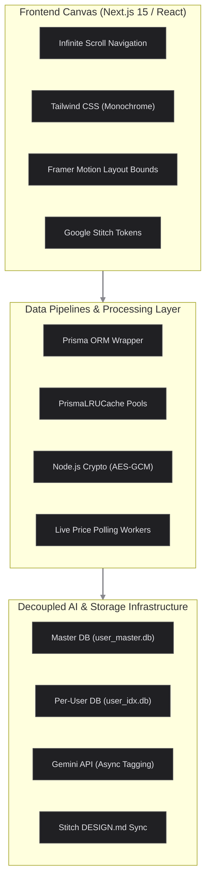

---
tags:
  - Project
  - finance
  - projects/fin-app/project-doc
---
---

# System Requirements & Architecture Document
## Project: Minimalist Multi-Asset Personal Finance Engine (MVP)

## 1. Executive Summary & Vision
This application is a hyper-minimalist, high-performance personal finance engine engineered for multi-asset consolidation. Bypassing generic, intrusive conversational "AI chatbots," the platform targets high-fidelity visual trajectories, absolute background data isolation, and a distinct layout philosophy inspired by the **Nothing OS** design aesthetic.

### Core Architecture Pillars
* **Physical Isolation:** Complete physical separation of user data to guarantee absolute privacy and clean localized state.
* **Cohesive Visual Identity:** Strict maintenance of a monochrome, dot-matrix, low-ink UI scaffolded through Google Stitch.
* **Deterministic Execution:** Prioritizing native code logic and local caching layers, leveraging Gemini AI exclusively for asynchronous background processing and schema discovery.

---

## 2. Technical Stack Matrix

The application utilizes a specialized unified architecture: a fluid React frontend governed by structural motion, backed by local serverless API processing routing data into independent database files.

---
### Core Technologies
* **Frontend Framework:** Next.js 15 (App Router) utilizing server-side rendering advantages for layout bounds and localized static processing.
* **Design Systems Canvas:** **Google Stitch** handles UI ideation, visual system layout extraction, component prototyping, and exporting production-ready React/Tailwind scaffolding.
* **UI Design Language:** Tailwind CSS matching the Nothing OS aesthetic—strict black/white scales, dot-matrix grid canvas elements, and custom `#FF007F` red visual markers.
* **Motion Framework:** Framer Motion managing viewport-anchored scrolling, state layout boundaries, and hardware-accelerated viewport adjustments.
* **Database & Connectivity Layer:** SQLite physical instances configured via Prisma ORM.
* **Core Cognitive Engine:** Gemini (Pro/Flash API) running exclusively out-of-band for text normalizations, metadata parsing, and historical insights generation.

---

## 3. Core Feature Specifications (MVP Scope)

### A. Consolidated Multi-Archetype Ledger
The platform unifies disparate financial vehicles into a cohesive time-series graph:
* **Liquid & Credit Accounts:** Automatic extraction via supported neobank APIs; legacy bank ingestion processed through local file parsers.
* **Investment Vehicles (Stocks & Managed Funds):** Cost-basis tracked via historical transaction records (buys/sells).
* **Live Valuation Engine:** A secure background worker periodically pulls asset price updates via lightweight ticker APIs, overlaying live asset prices onto the user's transaction history to maintain real-time net worth valuation.

### B. Two-Tier Data Ingestion Pipeline
To limit token waste and preserve deterministic reliability, CSV ingestion follows a strict execution path:
1. **Static Profiler (Primary):** The user defines column configurations once (e.g., Column A = Date, Column B = Description). This schema mapping is compiled as a localized Static Profile (`AMEX_Daily_Export`). Future uploads run purely via native JS code parsing, utilizing zero AI overhead.
2. **AI-Parsing Layer (Fallback):** In the event of an unmapped file format or sudden structural update by an institution, Gemini scans the file structure, normalizes the data array, handles columns matching, and prompts the user to save the result as a new permanent Static Profile.

### C. Background Intelligence Platform
AI is strictly integrated as an asynchronous utility layer:
* **Asynchronous Transaction Categorization:** Gemini operates purely in background threads, translating ambiguous, messy vendor descriptions into normalized taxonomy tags.
* **The Insights Engine:** A dedicated text component positioned at the baseline fold of the viewport. The engine feeds transaction summaries to Gemini asynchronously to display 2-3 precise, text-based strategic bulletins regarding financial goals.

---

## 4. UI/UX & Structural Motion Design

* **The Infinite Viewport Canvas:** The entire system maps onto a single, continuous vertical scroll interface. Traditional layout switching is entirely eliminated.
* **Fluid Anchor Navigation:** Menu triggers invoke hardware-accelerated smooth scrolling (`framer-motion` view anchors) that locks onto targeted interface components instantly.
* **Hero Visualization:** The top fold of the interface establishes the baseline metrics, presenting a high-contrast numeric display of **Total Net Worth** paired with a thin-line time-series trend area chart.

---

## 5. Absolute Technical Laws for AI & Engineering Agents

Agents writing or refactoring code within this repository MUST obey these absolute technical laws:

> [!danger] Law 1: Physical Tenant Isolation & Strict Connection Pooling
> * **Isolation:** User data is NOT separated by a mere `userId` column in a shared database. The system enforces physical SQLite file isolation.
> * **data/user_master.db**: Contains ONLY user credentials, security hashes, and access roles.
> * **data/user_{id}.db**: A dedicated SQLite database instance provisioned for each individual user account upon initial registration.
> * **Pooling:** You must NEVER instantiate a raw `PrismaClient` directly inside an API route. You must build and use an LRU Cache Manager (`PrismaLRUCache`) capped at 50 active connections that handles fetching, connecting, and gracefully evicting SQLite clients to prevent file descriptor exhaustion.

> [!warning] Law 2: Database-Level Aggregations Only (Prisma Math)
> Whenever calculating total account balances, category distributions, or running totals, you must use Prisma native math aggregations (`_sum`, `_avg`, `_count`). Do not fetch thousands of transaction rows into server memory to execute intensive JavaScript `.reduce()` loops.

> [!warning] Law 3: Absolute Ban on Nested $O(N^2)$ Loops
> When matching duplicate transactions, finding internal transfers, or staging bulk file imports, nested loops are strictly prohibited. You must structure normalization logic using JavaScript `Map` structures (e.g., grouping elements by ID or Amount) to execute data deduplication in linear $O(N)$ time.

> [!lock] Law 4: Secure Credential Storage
> Third-party API tokens (like Bank Developer Keys or Ticker API credentials) must be symmetrically encrypted via Node.js native `crypto` using `AES-256-GCM` before being written to the database. The encryption keys must rely on a persistent local filesystem lock-key (`data/.prism_key`) generated on first boot to safely survive session rotations.

> [!info] Law 5: Zero-AI-Slop Deterministic Pipelines
> The Gemini API must never run synchronously on the main thread during standard user navigation or core dashboard reads. Ingestion jobs must evaluate static template rules first. Gemini is restricted to background tag parsing and design-time schema discovery.

> [!info] Law 6: Visual Coherence via Google Stitch Configuration
> The frontend component architecture must strictly match layout constraints defined in `.stitch/DESIGN.md`. Any automated code generation or UI additions must reference the Google Stitch design token dictionary to preserve the Nothing OS typography, monochrome scaling, and restricted accent rules.

> [!performance] Law 7: Hardware-Accelerated Layout Constraints
> The single-page infinite layout must use hardware-accelerated transforms and Framer Motion view tracking. Unmounting main view wrappers during scrolling is strictly forbidden to completely eliminate layout thrashing and maintain consistent performance.